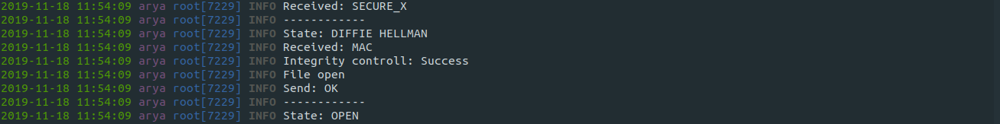
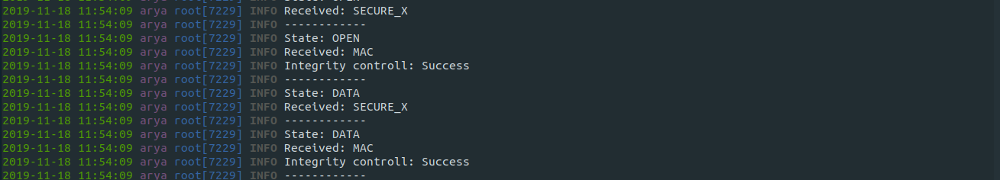

# Projeto 2: Comunicações Seguras  

**Universidade de Aveiro**  
Segurança Informática e Nas Organizações 2019/2020  

**Trabalho realizado por:**  

* 88808 - João Miguel Nunes de Medeiros e Vasconcelos 
* 88886 - Tiago Carvalho Mendes  

**Novembro de 2019**  

## **1. Introdução**  

O presente documento tem como principal objetivo descrever detalhadamente a solução desenvolvida tendo em conta os objetivos propostos para o segundo projeto da unidade curricular de [Segurança Informática e Nas Organizações](https://www.ua.pt/pt/uc/4143) da [Universidade de Aveiro](www.ua.pt), considerando o seu planeamento, desenho, implementação e validação tendo em conta o código fornecido como base para o trabalho.  

No guião de apresentação deste segundo projeto, era pedido o *planeamento*, *desenho*, *implementação* e *validação* de um protocolo que permita a **comunicação segura** (confidencial e íntegra) entre dois pontos, nomeadamente **um cliente e um servidor** através de uma ligação por **sockets TCP**, em [python](https://realpython.com/python-sockets/).

**Nota:** Este documento foi escrito utilizando **Markdown** e convertindo automaticamente para o formato ***pdf***, por isso algumas partes do mesmo estão quebradas entre págias.  

## **2. Planeamento**  

### **2.1 Objetivos do trabalho**

De modo a planear a solução a desenvolver, é necessário considerar **os seguintes aspetos**, presentes no guião de apresentação do projeto:  

1. **Desenhar um protocolo** para o estabelecimento de uma **sessão segura** entre o *cliente* e o *servidor*, suportando:  

    * a) Negociação dos algoritmos usados  
    * b) Confidencialidade  
    * c) Controlo de integridade  
    * d) Rotação de chaves  
    * e) Suporte de pelo menos duas cifras simétricas (ex: AES e Salsa20)  
    * f) Dois modos de cifra (ex: CBC e GCM)  
    * g) Dois algoritmos de síntese (ex: SHA-256 e SHA-512)  

2. **Implementar a negociação** de algoritmos de cifra entre cliente e servidor.  

3. **Implementar o suporte para confidencialidade**, resultando em mensagens cifradas.  

4. **Implementar o suporte para integridade**, resultando na adição de códigos de integridade às mensagens.  

5. **Implementar um mecanismo para rotação da chave** utilizada após um volume de dados ou tempo decorrido.  

Outros aspetos a considerar são **os seguintes**:  

* **Implementação de funções genéricas** de cifra/decifra/cálculo de um MAC/verificação de um MAC de textos  

* **Criação de novos tipos de mensagens** a enviar, incluindo as mensagens já existentes dentro do conteúdo destas novas mensagens (num formato cifrado e íntegro).  


### **2.2 Fluxo de troca de mensagens**    

Para cumprir os objetivos pretendidos com a realização deste projeto, primeiro definimos qual seria o **fluxo de troca de mensagens**, que de seguida iremos explicar. Este fluxo está dividido em 5 fases distintas:  

1. Início da negociação dos algoritmos a utilizar  
2. Incorporação do algoritmo de **Diffie Hellman**  
3. Início da troca de informação segura através de uma **mensagem *OPEN*** cifrada.  
4. Envio de pedaços (*chunks*) de um ficheiro através de várias **mensagens *DATA*** cifradas.  
5. Término da sessão após a transferência completa do ficheiro através de uma **mensagem *CLOSE*** cifrada.  

**Nota:** De realçar que as mensagens cifradas são seguidamente acompanhadas de uma **mensagem do tipo MAC**, com o intuito de controlar a integridade das mesmas.

De seguida, apresenta-se um **diagrama de sequências UML**, ilustrando todas as mensagens trocadas entre o *cliente* e o *servidor*:


## **3. Implementação**  

### **3.1. Negociação dos algoritmos utilizados**  

A sessão entre o *cliente* e o *servidor* inicia-se com a negociação do **algoritmo de cifra**, **modo de cifra** e **função de síntese** a utilizar. Para tal, o cliente informa o servidor dos algoritmos que possui através de uma mensagem do tipo `NEGOTIATION`:

```python=
algorithms = dict()
algorithms['symetric_ciphers'] = self.symetric_ciphers
algorithms['chiper_modes'] = self.cipher_modes
algorithms['digest'] = self.digest

message = {'type': 'NEGOTIATION', 'algorithms': algorithms}
self._send(message)
```

O *servidor*, ao receber e processar esta mensagem, verifica quais os algoritmos deste conjunto que tem disponíveis e informa o *cliente* através de uma mensagem do tipo `NEGOTIATION_RESPONSE` quais os algoritmos escolhidos:

```python=
chosen_algorithms = dict()
chosen_algorithms['symetric_ciphers'] = self.crypto.symmetric_cipher
chosen_algorithms['chiper_modes'] = self.crypto.cipher_mode
chosen_algorithms['digest'] = self.crypto.digest
message = {'type': 'NEGOTIATION_RESPONSE','chosen_algorithms': chosen_algorithms}
self._send(message)
```

**Nota:** A variável `self.crypto` é um objeto da classe `Crypto`, desenvolvida por nós, com todo o processamento criptográfico da nossa solução.  

Após receber a mensagem com os algoritmos a utilizar durante a sessão, o *cliente* termina a etapa de **negociação de algoritmos** e dá início ao processo de **troca de chaves** através do algoritmo de **Diffie Hellman**.  

De seguida seguem-se capturas de ecrã do funcionamento desta etapa, tanto no *cliente* como no *servidor*.

#### Servidor  


#### Cliente  


### **3.2. Troca de chaves utilizando o algoritmo Diffie Hellman**  

No seguimento do ponto anterior, o *cliente* inicia o processo de **troca de chaves** através do algoritmo de **Diffie Hellman**.

O cliente começa por gerar a sua componente pública e privada:

```python=
parameters = dh.generate_parameters(generator=2, key_size=512, backend=default_backend())

self.private_key = parameters.generate_private_key()
a_peer_public_key = self.private_key.public_key()
p=parameters.parameter_numbers().p
g=parameters.parameter_numbers().g
y=a_peer_public_key.public_numbers().y

self.public_key=a_peer_public_key.public_bytes(crypto_serialization.Encoding.PEM,crypto_serialization.PublicFormat.SubjectPublicKeyInfo)

return(self.public_key,p,g,y)
```

Através de uma mensagem do tipo `DH_PARAMETERS` este envia a componente pública, o valor primo ,`p`, e o valor do gerador, `g`, para que o servidor possa criar um objeto do tipo `DHParameters` igual ao do cliente e transiciona para o estado `STATE_DH`:

```python=
message = {'type':'DH_PARAMETERS','parameters':{'p':p,'g':g,'public_key':str(bytes_public_key,'ISO-8859-1')}}
self._send(message)
self.state=STATE_DH
```

O servidor ao receber esta mensagem vai criar um objeto do tipo `DH_PARAMETERS` igual ao do cliente e cria a sua componente pública e a sua componente privada. Com o auxilio da componente pública do cliente, o servidor cria a `shared_key` que irá ser derivada para criar a `symetric_key` que vai ser utilizada na comunicação entre o cliente e o servidor:


```python=
if(self.digest=="SHA256"):
    alg=hashes.SHA256()
elif(self.digest=="SHA384"):
    alg=hashes.SHA384()
elif(self.digest=="MD5"):
    alg=hashes.MD5()
elif(self.digest=="SHA512"):
    alg=hashes.SHA512()
elif(self.digest=="BLAKE2"):
    alg=hashes.BLAKE2b(64)

kdf = HKDF(
    algorithm=alg,
    length=32,
    salt=None,
    info=b'handshake data',
    backend=default_backend()
)

key = kdf.derive(self.shared_key)

if self.symmetric_cipher == 'AES':
    self.symmetric_key = key[:16]
elif self.symmetric_cipher == '3DES':
    self.symmetric_key = key[:8]
elif self.symmetric_cipher == 'ChaCha20':
    self.symmetric_key = key[:32]    
```

De seguida o servidor transiciona para o estado `STATE_DH` e envia a sua componente pública ao cliente,através de uma mensagem do tipo `DH_PARAMETERS_RESPONSE`:

```python=
message={'type':'DH_PARAMETERS_RESPONSE','parameters':{'public_key':str(self.crypto.public_key,'ISO-8859-1')}}
self._send(message)   
```

Por fim, o cliente ao receber a componente pública do servidor transiciona para o estado `STATE_OPEN` e cria a `shared_key` que irá ser derivada para criar a `symetric_key` (igual para ambos os interlocutores). A `symetric_key` vai ser utilizada na comunicação entre o cliente e o servidor:

```python=
public_key_server=crypto_serialization.load_pem_public_key(bytes_public_key,backend=default_backend())
self.shared_key=self.private_key.exchange(public_key_server)
```  

De seguida seguem-se capturas de ecrã do funcionamento desta etapa, tanto no *cliente* como no *servidor*.

#### Servidor  


#### Cliente  


### **3.3. Confidencialidade**  

Após a troca de chaves descrita no ponto anterior, o *cliente* dá início à troca de informação através do envio de uma mensagem do tipo `OPEN`:

```python=
message = {'type': 'OPEN', 'file_name': self.file_name}
```

No entanto, esta forma de enviar a mensagem **não é de todo segura.** Portanto, e visto que se pode proceder à **encriptação** e **desencriptação** através das chaves simétricas partilhadas, o *cliente* irá enviar uma nova mensagem do tipo `SECURE_X`, que irá ter como `'payload'` a mensagem do tipo `OPEN` encriptada:  

```python=
secure_message = {'type': 'SECURE_X', 'payload': None}
payload = json.dumps(message).encode()
criptogram = self.crypto.file_encryption(payload)
secure_message['payload'] = base64.b64encode(criptogram).decode()
self._send(message)
```

**Nota:** Com o intuito de simplificar a explicação, este pedaço de código foi adaptado, não estando rigorosamente igual ao da solução entregue.

A função `self.crypto.file_encryption(payload)`, semelhante à desenvolvida nas aulas práticas da unidade curricular, encripta um conjunto de **bytes** segundo o algoritmo de **cifra simétrica** e o modo de **cifra** escolhidos no *processo de negociação*, corrigindo o **block_size** do último bloco através de um **padding,** retornando por fim o criptograma.

O *servidor*, ao receber a mensagem do tipo `SECURE_X`, guarda o conteúdo do campo `'payload'` na variável `self.encrypted_data` (que será útil na transferência do ficheiro, como explicado mais à frente). De seguida, e **só após** confirmar a **integridade da mensagem** (também explicado mais à frente), o *servidor* desencripta o `'payload'` e processa a mensagem (neste caso do tipo `OPEN`) com o código já fornecido (podendo ser também do tipo `DATA` ou `CLOSE`).  

Esta lógica de encriptação e desencriptação de mensagens está implementada tanto no *cliente* como no *servidor*. Assim, pode-se garantir a **confidencialidade** das mensagens trocadas.

De seguida seguem-se capturas de ecrã do funcionamento do envio de mensagens do tipo `SECURE_X` com um `'payload'` cifrado do tipo `OPEN`, tanto no *cliente* como no *servidor*:

#### Servidor  


#### Cliente  


### **3.4. Controlo de integridade**  

Como explicado no ponto anterior, após a troca de chaves utilizando o algoritmo de **Diffie Hellman**, todas as mensagens são cifradas no *cliente* antes de serem enviadas para o *servidor*. Ao serem recebidas no *servidor*, este necessita de verificar **a integridade** da mensagem recebida antes de **a desencriptar**. Portanto, e seguindo o princípio de ***Encrypt-then-MAC***, o *cliente* gera um `MAC` através da chave partilhada e da função de síntese escolhida no processo de negociação da seguinte forma:  

```python=
if self.digest == "SHA256":
    h = hmac.HMAC(self.shared_key, hashes.SHA256(), backend=default_backend())
elif self.digest == "SHA384":
    h = hmac.HMAC(self.shared_key, hashes.SHA384(), backend=default_backend())
elif self.digest == "MD5":
    h = hmac.HMAC(self.shared_key, hashes.MD5(), backend=default_backend())
elif self.digest == "SHA512":
    h = hmac.HMAC(self.shared_key, hashes.SHA512(), backend=default_backend())
elif self.digest == "BLAKE2":
    h = hmac.HMAC(self.shared_key, hashes.BLAKE2b(64), backend=default_backend())
```

Após a geração do `MAC`, o *cliente* envia uma mensagem do tipo `MAC` da seguinte forma: 

```python=
message = {'type': 'MAC'}
message['data'] = base64.b64encode(self.crypto.mac).decode()
message['iv'] = iv
message['tag'] = tag
message['nonce'] = nonce
self._send(message)
```
**Nota:** Os campos `'iv'`, `'tag'`e `'nonce'` são necessários para os modos de cifra de **CBC** (*iv*), **GCM** (*iv* e *tag*) e para a cifra simétrica **ChaCha20** (*nonce*).  

Deste modo, o *servidor* ao receber a mensagem **cifrada** e a mensagem **com o MAC**, gera um novo `MAC` da mesma forma que o *cliente* e compara o **valor gerado com o valor recebido**. Caso sejam iguais, pode-se garantir a **integridade/autenticidade** da mensagem recebida, podendo ser desencriptada. Caso contrário, o *servidor* envia uma mensagem de `ERROR` ao cliente, com o falhanço do **controlo de integridade** da mensagem.  

De seguida seguem-se capturas de ecrã do funcionamento do envio de mensagens do tipo `SECURE_X` com um `'payload'` de `DATA` e do tipo `MAC`, tanto no *cliente* como no *servidor*:

#### Servidor  


#### Cliente  


### **3.5. Rotação de chaves**  

Uma vez que o principal objetivo deste trabalho é o envio de **um ficheiro de forma segura**, é necessário implementar um **mecanismo de rotação de chaves** que garanta a alteração da chave após ter sido ultrapassado um certo **threshold**.

O cliente começa por ler o ficheiro em blocos de `960 bytes` e envia esses blocos através de uma mensagem do tipo `DATA` garantindo confidencialidade através do método referido no ponto `3.3 Confidencialidade`:

``` python=
data = f.read(16 * 60)
message['data'] = base64.b64encode(data).decode()
logger.debug("Data: {} read size {}".format(data,f.tell()))
secure_message = self.encrypt_payload(message)

self._send(secure_message)
self.send_mac()
```

Ao atingir o threshold de 1000 blocos o cliente inicia novamente o processo de criação de uma chave através do `Diffie_Helman`. Este guarda a posição onde se encontrava a ler o ficheiro e transiciona para o estado `STATE_KEY_ROTATION` após enviar a mensagem do tipo `DH_PARAMETERS`:

```python=
if self.chunk_count==1000:
    # Generate Diffie Helman client private and public keys
    bytes_public_key,p,g,y=self.crypto.diffie_helman_client()
    message={'type':'DH_PARAMETERS','parameters':{'p':p,'g':g,'public_key':str(bytes_public_key,'ISO-8859-1')}}
    self.chunk_count=0
    self.last_pos=f.tell()
    self.state=STATE_KEY_ROTATION
    self._send(message)
    break
```

Seguindo o flow mencionado no ponto `3.2. Troca de chaves utilizando o algoritmo Diffie Hellman` o servidor e o cliente chegam a uma nova `symetric_key` que vai ser utilizada na comunicação segura entre o servidor e o cliente.

Como o cliente se encontra no estado `STATE_KEY_ROTATION`, após receber a mensagem do tipo `DH_PARAMETERS_RESPONSE` irá continuar a enviar o ficheiro em vez de enviar uma mensagem do tipo `OPEN` acabando por transicionar novamente para o estado `STATE_OPEN`.

``` python=
if self.state==STATE_KEY_ROTATION:
    self.state = STATE_OPEN
    self.send_file(self.file_name)

elif self.state==STATE_DH:
    secure_message = self.encrypt_payload({'type': 'OPEN', 'file_name': self.file_name})
    self._send(secure_message)
    self.send_mac()
    self.state = STATE_OPEN
```
Ao enviar o ficheiro, o cliente vai continuar na zona onde estava antes de iniciar a rotação de chaves:

```python=
if self.last_pos != 0:
    f.seek(self.last_pos)
    self.last_pos=0
```

De seguida seguem-se capturas de ecrã do funcionamento da rotação de chaves, tanto no *cliente* como no *servidor*, no meio da transferência de um grande ficheiro:  

#### Servidor  


#### Cliente  


### **3.6. Finalização da comunicação**  

Após o envio de todos os blocos que constituem o ficheiro, o cliente envia uma mensagem do tipo `CLOSE` através do método referido no ponto `3.3 Confidencialidade` e termina sua conexão com o servidor:

```python=
self._send(self.encrypt_payload({'type': 'CLOSE'}))
self.send_mac()
logger.info("File transferred. Closing transport")
self.transport.close()
```

#### Cliente: 


## **4. Conclusão**  

Após a realização deste segundo trabalho prático, concluímos que os objetivos propostos no guião disponibilizado foram, de uma forma geral, alcançados com sucesso. Com este trabalho, os nossos conhecimentos sobre comunicações seguras e mecanismos de segurança utilizados para as implementar aumentaram. É de salientar ainda que o trabalho de equipa e a superação de dificuldades foram fatores importantíssimos no sucesso do trabalho, melhorando as competências interpessoais de ambos os elementos do grupo.

## **5. Bibliografia**    

A bibliografia utilizada foi a seguinte:  

* [cryptography.io](https://cryptography.io)
* [https://joao.barraca.pt/](https://joao.barraca.pt/)