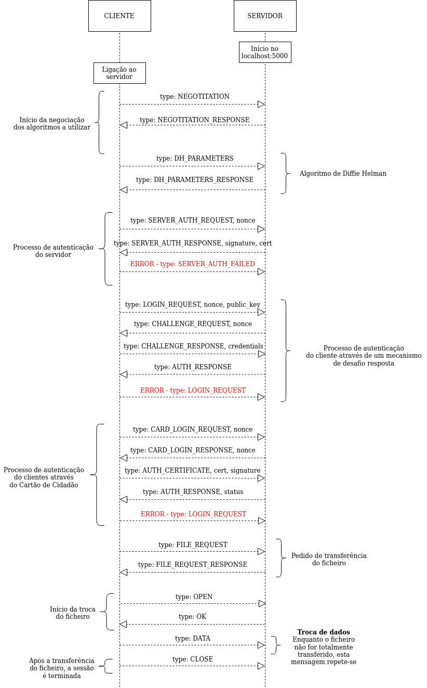
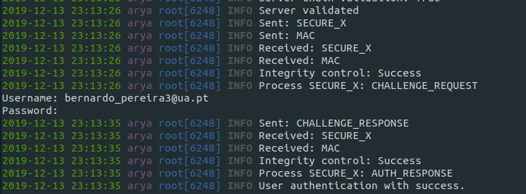
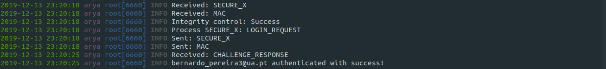
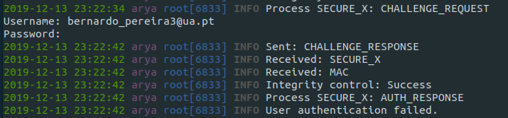
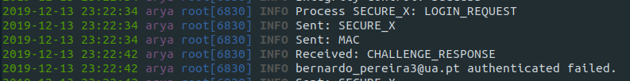
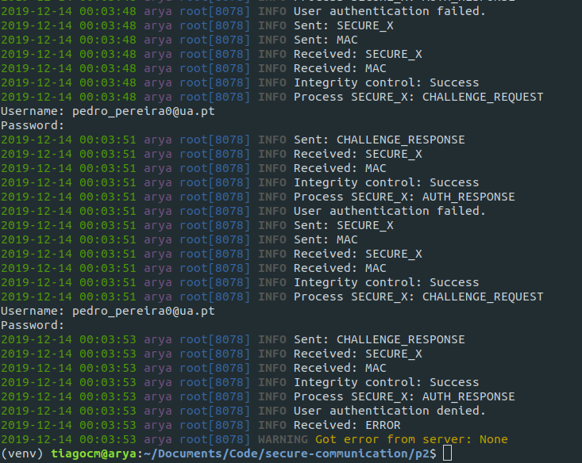
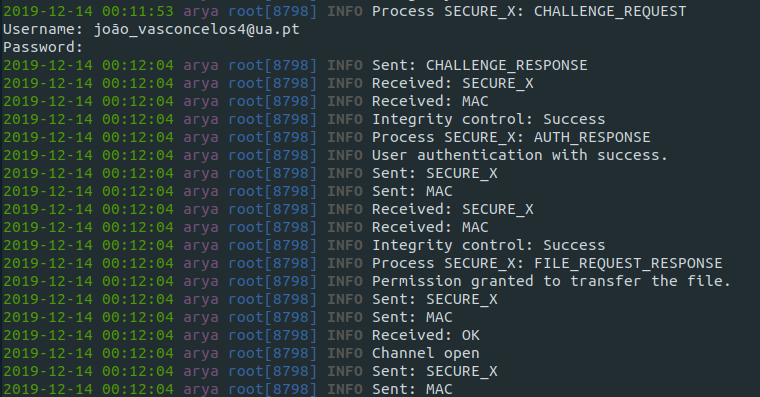
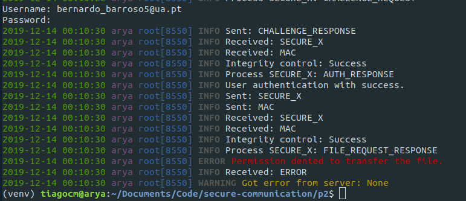

# Projeto 3: Autenticação 

**Universidade de Aveiro**  
Segurança Informática e Nas Organizações 2019/2020  

**Trabalho realizado por:**  

* 88808 - João Miguel Nunes de Medeiros e Vasconcelos 
* 88886 - Tiago Carvalho Mendes  

**Dezembro de 2019**  

## **1. Introdução**  

O presente documento tem como principal objetivo descrever detalhadamente a solução desenvolvida tendo em conta os objetivos propostos para o terceiro projeto da unidade curricular de [Segurança Informática e Nas Organizações](https://www.ua.pt/pt/uc/4143) da [Universidade de Aveiro](www.ua.pt), considerando o seu planeamento, desenho, implementação e validação, tendo em conta o código fornecido como base para o trabalho. 

## **2. Planeamento**  

### **2.1 Objetivos do trabalho**

De modo a planear a solução a desenvolver, é necessário considerar **os seguintes aspetos**, presentes no guião de apresentação do projeto:  

1. **Desenhar um protocolo** para o estabelecimento de uma **sessão segura** entre um *cliente* e um *servidor*, com autenticação de **ambos** os intervenientes, suportando:  

    * a) Autenticação do cliente através do cartão de cidadão  
    * b) Autenticação do cliente através de desafio resposta  
    * c) Controlo de acesso 
    * d) Autenticação do servidor utilizando certificados X.509  

2. **Implementar a autenticação do cliente**, através do cartão de cidadão.  

3. **Implementar a autenticação do cliente**, através de desafio resposta.  

4. **Implementar o suporte para controlo de acesso**.  

5. **Implementar a autenticação do servidor** utilizando certificados X.509.  

Outros aspetos a considerar são **os seguintes**:  

* **Implementação de funções genéricas** de assinatura de documentos e respetiva verificação, carregamento de certificados, geração de pares de chaves assimétricas, entre outras.

### **2.2 Fluxo de troca de mensagens**    

Para implementar os requisitos pedidos neste trabalho, definimos primeiramente qual seria o **fluxo de troca de mensagens** entre o *cliente* e o *servidor*, que de seguida iremos explicar. De modo a aumentar a segurança da nossa solução, decidimos manter alguns mecanismos utilizados na realização do **Projeto 2: Comunicações Seguras.** Este fluxo está divido em **oito fases distintas:** 

1. Início da negociação dos algoritmos a utilizar (cifras simétricas, modos de cifra e síntese)  
2. Realização do algoritmo de **Diffie Helman**  
3. Processo de autenticação do servidor, requerido pelo cliente.  
4. Processo de autenticação do cliente, iniciado por este com um pedido ao servidor, podendo ser realizado em uma de duas possíveis sub-fases:  
    **4.1.** Autenticação através de um mecanismo de desafio resposta  
    **4.2.** Autenticação através do cartão de cidadão.  

5. Pedido de transferência do ficheiro por parte do cliente, tendo em conta um mecanismo de controlo de acessos.  
6. Início da troca de informação segura através de uma **mensagem OPEN** cifrada.  
7. Envio de **pedaços** (*chunks*) de um ficheiro através de várias **mensagens DATA** cifradas.
8. Término da sessão após a transferência completa do ficheiro através de uma **mensagem CLOSE** cifrada.  

**Nota:** De realçar que todas as mensagens trocadas (exceto as enviadas antes do término da **fase 2**) são cifradas no campo **payload** de uma mensagem do tipo **SECURE_X**, acompanhadas seguidamente de **uma mensagem do tipo MAC**, com o intuito de garantir a confidencialidade e integridade das mesmas, respetivamente.  

De seguida, apresenta-se um **diagrama de sequências UML**, ilustrando todas as mensagens trocadas entre o cliente e o servidor:



## **3. Implementação**  

### **3.1. Implementação do protocolo para autenticação do servidor através de certificados X.509**  

A autenticação do *servidor* inicia-se com a geração de um **NONCE** por parte do *cliente*. De seguida, o *cliente* envia ao *servidor* o **NONCE** através de uma mensagem do tipo `SERVER_AUTH_REQUEST`:

```python=
self.crypto.auth_nonce = os.urandom(16)
message = {'type': 'SERVER_AUTH_REQUEST', 'nonce':  base64.b64encode(self.crypto.auth_nonce).decode()}
secure_message = self.encrypt_payload(message)
self.state = STATE_SERVER_AUTH
self._send(secure_message)
self.send_mac()
```

O *servidor*, ao receber e processar esta mensagem, carrega o seu certificado, o certificado da sua raiz e a chave privada associada ao seu certificado, usando-a para assinar o **NONCE** enviado pelo *cliente* . De seguida, o *servidor* envia ao cliente o seu certificado, o certificado da sua raiz e a assinatura através de uma mensagem do tipo `SERVER_AUTH_RESPONSE`:

```python=
self.crypto.server_cert = self.crypto.load_cert("server_cert/secure_server.pem")
self.crypto.server_ca_cert = self.crypto.load_cert("server_roots/Secure_Server_CA.pem")
self.crypto.rsa_private_key = self.crypto.load_key_from_file("server_cert/server_key.pem")

nonce = base64.b64decode(message['nonce'].encode())

self.crypto.signature = self.crypto.rsa_signing(nonce, self.crypto.rsa_private_key)
message = {'type': 'SERVER_AUTH_RESPONSE','signature': base64.b64encode(self.crypto.signature).decode(),'server_cert': base64.b64encode(self.crypto.get_certificate_bytes(self.crypto.server_cert)).decode(),'server_roots': base64.b64encode(self.crypto.get_certificate_bytes(self.crypto.server_ca_cert)).decode()}

self._send(message)
```

**Nota:** A variável `self.crypto` é um objeto da classe `Crypto`, desenvolvida por nós e contendo todo o processamento criptográfico da nossa solução.  

Após receber a mensagem com a assinatura e com os certificados, o *cliente* valida a assinatura criada pelo *servidor* com a chave pública deste. De seguida, valida se o **common_name** do certificado do servidor é igual ao nome do servidor que ele supõe estar a contactar:

```python=
# Validate server signature
flag1 = self.crypto.rsa_signature_verification(self.crypto.signature, self.crypto.auth_nonce, self.crypto.server_public_key)
logger.info(f'Server signature validation: {flag1}')

# Validate common name
flag2 = self.host_name == self.crypto.get_common_name(self.crypto.server_cert)
logger.info(f'Server common_name validation: {flag2}')
```

Por fim o *cliente* cria a **cadeia de certificados do *servidor*** e executa todas as operações necessárias para validar cada certificado da chain:
 
1. Validar data de expiração:  

```python=
today = datetime.now().timestamp()
return cert.not_valid_before.timestamp() <= today <= cert.not_valid_after.timestamp()
```  

2. Validar purpose:  

```python=
if index == 0:
    flag = False
    for c in cert.extensions.get_extension_for_class(x509.ExtendedKeyUsage).value:
        if c.dotted_string == "1.3.6.1.5.5.7.3.1":
            flag = True
            break
    return flag
else:
    if cert.extensions.get_extension_for_class(x509.KeyUsage).value.key_cert_sign == True:
        return True
    else:
        return False
```  

**Ao validar o purpose dos certificados**, verifica-se que o primeiro certificado tem uma validação diferente dos outros. No primeiro certificado, (que é o **certificado do servidor**), temos de garantir que inclui a KeyUsage **SERVER_AUTH**. Nos próximos certificados temos de garantir que incluem a KeyUsage **key_cert_sign**:

3. Validar a assinatura do certificado:  

```python=
cert_to_check_signature = cert_to_check.signature
issuer_public_key = issuer_cert.public_key()

try:
    issuer_public_key.verify(cert_to_check_signature,cert_to_check.tbs_certificate_bytes,padding.PKCS1v15(),cert_to_check.signature_hash_algorithm)
except:
    print("Failed to verify signature.")
    return False

return True
```

4. Validar o common name do certificado:  

```python=
if (self.get_issuer_common_name(cert_to_check)!=self.get_common_name(issuer_cert)):
    print(self.get_issuer_common_name(cert_to_check))
    print(self.get_common_name(issuer_cert))
    return False 

return True
```

5. Validar o estado de revogação do certificado:  

```python=
try:
    builder = ocsp.OCSPRequestBuilder()

    builder = builder.add_certificate(cert_to_check, issuer_cert, SHA1())
    req = builder.build()
    for j in cert_to_check.extensions.get_extension_for_class(x509.AuthorityInformationAccess).value:
        if j.access_method.dotted_string == "1.3.6.1.5.5.7.48.1": 
            rev_list = None

            # Downloading list
            der = req.public_bytes(serialization.Encoding.DER)

            ocsp_link = j.access_location.value
            r = requests.post(ocsp_link, headers={'Content-Type': 'application/ocsp-request'},data=der)

            
            ocsp_resp = ocsp.load_der_ocsp_response(r.content)
            if ocsp_resp.certificate_status == ocsp.OCSPCertStatus.GOOD:
                return False
            else:
                return True

except Exception as e:
    print(e)
    print("OCSP not available")

try:
    for i in cert_to_check.extensions.get_extension_for_class(x509.CRLDistributionPoints).value:
        for b in i.full_name:
            rev_list = None
            # Downloading list
            file_name = wget.download(b.value)
            # Read revocation list
            try:
                rev_list = self.load_cert_revocation_list(file_name,"pem")
            except Exception as e:
                print(e)
            try:
                rev_list = self.load_cert_revocation_list(file_name,"der")
            except:
                print("Not der.")
            if rev_list is None:
                return False
            
            flag = cert_to_check.serial_number in [l.serial_number for l in rev_list]
except Exception as e:
    print("CRL not available")
```
**Ao validar o estado de revogação dos certificados**, inicialmente tentamos realizar esta tarefa através de **OCSP** e, caso não seja possível, recorremos **à CRL e às DeltaCRL**. 

**Nota:** É importante referir que parte do código foi omitido do relatório por ser muito extenso.

Se todas estas condições forem validadas, o *cliente* irá também validar o *servidor* e transitar para a próxima de fase do processo, onde se irá tentar autenticar.

**Nota:** Os certifcados usados para representar o servidor foram criados através do programa **XCA** e exportados no formato **PEM** para poderem ser carregados pelo *servidor* e enviados para o *cliente*. Adicionalmente, criámos uma lista de certificados e colocámo-la num endereço online para poder ser incluída nos certificados como ***CRLDistributuion Point***, permitindo assim a validação do estado de revogação dos certificados do servidor pelo cliente.

#### Servidor  
  

#### Cliente  
  


### **3.2. Implementação do protocolo para autenticação de utentes através da apresentação de senhas**  

Após o processo de autenticação do *servidor*, o *cliente* necessita primeiro de se autenticar antes de fazer qualquer pedido para a transferência de um ficheiro. Tendo isto em mente, decidimos implementar duas possíveis formas de autenticação do cliente para com o servidor: através de **um mecanismo de desafio-resposta** ou ainda **através do cartão de cidadão.** 

**NOTA IMPORTANTE:** Caso pretenda alterar o modo de autenticação do cliente, terá de mudar o valor de variável `self.validation_type`, no ficheiro `client.py` **(linha 64)** para **"CHALLENGE"** ou **"CITIZEN_CARD".**

Neste ponto iremos abordar a nossa implementação relativa ao **mecanismo de desafio-resposta.** Portanto, eis o nosso procedimento:  

1. Antes de qualquer pedido, o *cliente* gera um par de chaves assimétricas da seguinte forma:  

```python3=
def key_pair_gen(self, length):
    valid_lengths = [1024, 2048, 3072, 4096]

    if length not in valid_lengths:
        logger.debug("ERROR - Not a valid length!")
        return 
            
    # Private key generation
    private_key = rsa.generate_private_key(
        public_exponent=65537, 
        key_size=length,
        backend=default_backend()
    )

    pem = private_key.private_bytes(
        encoding=serialization.Encoding.PEM,
        format=serialization.PrivateFormat.PKCS8,
        encryption_algorithm=serialization.NoEncryption()
    )

    priv_key = base64.b64encode(pem).decode()

    # Public key generation
    public_key = private_key.public_key()
    pem = public_key.public_bytes(
        encoding=serialization.Encoding.PEM,
        format=serialization.PublicFormat.SubjectPublicKeyInfo
    )
    pub_key = base64.b64encode(pem).decode()

    return (pub_key, priv_key)
```

2. De seguida, o *cliente* envia uma mensagem ao *servidor* do tipo `LOGIN_REQUEST`, juntamente com um ***nonce*** e a **chave-pública** gerada no ponto anterior (ambos no formato de *base64*). 

```python3=
message = {'type': 'LOGIN_REQUEST', 'nonce':  base64.b64encode(self.crypto.auth_nonce).decode(), 'public_key': self.rsa_public_key}
secure_message = self.encrypt_payload(message)
self._send(secure_message)
self.send_mac()
```

**Nota:** Para enviar esta mensagem, foi aproveitado o código desenvolvido no **Projeto 2: Comunicações Seguras**, de modo a cifrar a mensagem `LOGIN_REQUEST`, adicionando-a a um campo de `'payload'` de uma mensagem do tipo `SECURE_X`, de modo a garantir a confidencialidade do conteúdo enviado. Imediatamente de seguida, é enviado um `MAC`, de modo a garantir a integridade da mensagem anteriormente enviada. De salientar ainda que as próximas mensagens são também encriptadas.  


3. O *servidor*, ao receber o pedido de autenticação por desafio-resposta, guarda o ***nonce*** e a **chave-pública** do cliente e envia-lhe um desafio (um novo ***nonce***) através de uma mensagem do tipo `CHALLENGE_REQUEST`.

```python3=
self.state = STATE_CLIENT_AUTH
self.client_nonce = base64.b64decode(message['nonce'].encode())
self.crypto.auth_nonce = os.urandom(16)
self.client_public_key = base64.b64decode(message['public_key'].encode())
message = {'type': 'CHALLENGE_REQUEST', 'nonce': base64.b64encode(self.crypto.auth_nonce).decode()}
secure_message = self.encrypt_payload(message)
self._send(secure_message)
self.send_mac()
```  

4. O *cliente*, ao receber o desafio do *servidor*, primeiramente introduz o seu **nome de utilizador** e a sua **palavra-passe**, da seguinte forma:  

```python3=
self.credentials['username'] = input("Username: ")
self.credentials['password'] = getpass.getpass("Password: ")
```  

De seguida, concatena o seu **nonce** gerado, com a sua **palavra-passe** e com o **nonce** recebido do servidor, nesta ordem. Tendo esta **resposta**, o *cliente* assina-a com a sua **chave-privada** gerada no **ponto 1.**. Por fim, envia ao servidor o seu nome de utilizador e a mensagem assinada através de uma mensagem do tipo `CHALLENGE_RESPONSE`:  

```python3=
self.server_nonce = str(base64.b64decode(message['nonce'].encode()))
message = str(self.crypto.auth_nonce) + self.credentials['password'] + self.server_nonce
private_key = self.crypto.load_private_key(base64.b64decode(self.rsa_private_key.encode()))
self.signed_challenge = self.crypto.rsa_signing(message.encode(), private_key)

message = {}
message['type'] = 'CHALLENGE_RESPONSE'
message['credentials'] = {}
message['credentials']['username'] = self.credentials['username']
message['credentials']['signed_challenge'] = base64.b64encode(self.signed_challenge).decode()
self._send(message)
```  

5. O *servidor*, ao receber a resposta do *cliente*, primeiro verifica se o nome de utilizador fornecido está registado em persitência e se tem permissão de autenticação (explicado com maior detalhe na secção **3.3. Implementação do mecanismo para controlo de acesso**):  

```python3=
if username not in self.registered_users or 'A1' not in self.registered_users[username][1]:
	message = {'type': 'AUTH_RESPONSE', 'status': 'DENIED'}
	secure_message = self.encrypt_payload(message)
	self._send(secure_message)
	self.send_mac()
	return False
```  

Caso o nome de utilizador introduzido esteja registado no sistema, o *servidor* carrega a sua **palavra-passe** e concatena o **nonce** recebido do cliente no **ponto 2.** com a palavra-passe carregada e com o seu **nonce**, por esta ordem e idêntica à realizada pelo cliente no **ponto 4.**. De seguida, o *servidor* valida a **mensagem assinada recebida** através da chava-pública do cliente. Caso a mensagem assinada seja corretamente validada, o *servidor* garante a autenticidade do nome de utilizador em questão, enviando-lhe uma mensagem do tipo `AUTH_RESPONSE` com um `'status'` de `SUCCESS`:  

```python3=
signed_challenge = message['credentials']['signed_challenge']
pw, permissions = self.registered_users[username][0], self.registered_users[username][1]	
signature_verification = self.crypto.rsa_signature_verification(base64.b64decode(signed_challenge.encode()), (str(self.client_nonce) + pw + str(self.crypto.auth_nonce)).encode(), self.crypto.load_public_key(self.client_public_key))

if signature_verification:
	message = {'type': 'AUTH_RESPONSE', 'status': 'SUCCESS', 'username': username}
	secure_message = self.encrypt_payload(message)
	self._send(secure_message)
	self.send_mac()
	self.authenticated_user = [username, permissions]
```

Caso a mensagem assinada não seja corretamente validade, o *servidor* não consegue autenticar o *cliente*, pelo que lhe manda uma mensagem do tipo `AUTH_RESPONSE` mas com um `'status'` de `FAILED`:  

```python3=
message = {'type': 'AUTH_RESPONSE', 'status': 'FAILED'}
secure_message = self.encrypt_payload(message)
self._send(secure_message)
self.send_mac()
```

De seguida seguem-se capturas de ecrã do modo de funcionamento deste mecanismo, tanto do lado do *cliente* como do *servidor*:  

**Cliente: autenticação com sucesso**  



**Servidor: autenticação com sucesso**  



**Cliente: palavra-passe incorreta**  

  

**Servidor: palavra-passe incorreta**  

  

### **3.3. Implementação do mecanismo para controlo de acesso**  

Outro dos objetivos deste trabalho prático era a implementação de um mecanismo para **controlo de acesso** dos utilizadores registados no servidor, permitindo indicar **explicitamente** se um utilizador poderia ou não transferir ficheiros. 

Para tal, decidimos gerar diversos **nomes de utilizadores aleatórios**, cada um com uma **palavra-passe** de 20 caracteres (também esta aleatória). O alfabeto base de geração destas palavras passes tinha os seguintes 66 carateres: 

```
abcdefghijklmnopqrstuvwxyz123456789!#$%&'()*+,-./:;<=>?@[\]^_`{|}~`
```

permitindo gerar **66^20 palavras-passes distintas**, tornando os ataques por dicionário praticamente impossíveis.
Relativamente às permissões de acesso de cada utilizador, definimos dois tipos de permissões: **AUTENTICAÇÃO** (flag 'A') e **TRANSFERÊNCIA** (flag 'T'). Quando à flag 'A', esta verifica se um determinado nome de utilizador, mesmo registado em persistência no servidor, tem permissão de se autenticar ('A' = 1) ou não ('A' = 0). Quando à flag 'T', esta verifica se um determinado nome de utilizador tem permissão de tranferência de ficheiros ('T' = 1), ou não ('T' = 0). 

O conteúdo do ficheiro `users.csv` é o seguinte:  

```
Username	Password	Permissions
pedro_pereira0@ua.pt	+w,rzvbq<g+,l3ub+q^g	A0-T0
diogo_mendes1@ua.pt	i*gl}a{g?tc-x!<t:'$}	A1-T0
bernardo_vasconcelos2@ua.pt	ynpax9<1;{exgdz`{ah<	A1-T1
bernardo_pereira3@ua.pt	uege|%6]jw|qf=~onm<^	A1-T1
joão_vasconcelos4@ua.pt	5i9;!l;,:471ro4z+ix\	A1-T1
bernardo_barroso5@ua.pt	3k7*wa?/ba)|\oi5rv#)	A1-T0
pedro_amorim6@ua.pt	;d{kli;jn-wd:#=9=o_j	A1-T1
diogo_mendes7@ua.pt	2&47;j_@`'bv+$l'$q>f	A1-T0
diogo_carvalho8@ua.pt	{u^=g`pr9c?.y,[z4#/!	A1-T1
bernardo_mendes9@ua.pt	>{_1*ub4|\&>=)ehs8w?	A1-T1
```

Um potencial problema com este ficheiro é o facto de o seu conteúdo (em particular as palavras-passes) estarem em **plain text.** Para resolver este problema, uma possível solução seria a de o *servidor* gerar um par de chaves assimétricas e, no momento de registo de um novo utilizador,  encriptar a palavra-passe no ficheiro com a sua **chave-pública**. Mais tarde, no processo de autenticação, o *servidor*, ao carregar a palavra-passe encriptada do ficheiro `users.csv`, poderia desencriptá-la com a sua **chave-privada**, garantindo a confidencialidade de todas as palavras-passes armazenadas em persistência no *servidor*.  


Após explicado o desenho do mecanismo de controlo de acessos, iremos descrevê-lo em acção no nosso fluxo de troca de mensagens.

* **Controlo de autenticação:**  

Quando um determinado utilizador se tenta autenticar, para além de ser necessário cumprir as condições expostas no ponto **3.2. Implementação do protocolo para autenticação de utentes através da apresentação de senhas**, o nosso mecanismo pressupõe que este apenas se possa autenticar caso tenha a **flag 'A'** com o valor 1. Por defeito, todos os novos utilizadores registados têm **A = 1**. No entanto, para prevenir tentativas de autenticação indevidas, decidimos implementar a seguinte filosofia: caso um determinado nome de utilizador tente autenticar-se no servidor **três vezes seguidas sem sucesso**, esta tentativa de autenticação é catalogada como sendo **suspeita**, pelo que esse nome de utiliador perde a permissão a autenticar-se no servidor, passando a **flag 'A'** para o valor de 0 (sendo atualizada em persistência):  

```python=
self.authentication_tries += 1
if self.authentication_tries == 3:
	# remove authentication permission
	self.registered_users[username][1] = self.registered_users[username][1].replace('1', '0')
	self.update_users()
	logger.info("{} authenticated denied.".format(username))
	message = {'type': 'AUTH_RESPONSE', 'status': 'DENIED'}
	secure_message = self.encrypt_payload(message)
	self._send(secure_message)
	self.send_mac()
``` 

**Cliente - Captura de ecrã de um cliente a perder a permissão de autenticação após 3 tentativas:**




* **Controlo de transferência de ficheiro:**  

Após ser autenticado, um utilizador pede permissão para transferir um determinado ficheiro. Ora, e assentando nos pressupostos descritos em cima, o requerente só será capaz de transferir o ficheiro caso a **flag 'T'** tenha o valor de 1. No caso contrário, e por questões de simplificação do fluxo de troca de mensagens, o servidor encerra a conexão com este utilizador. 

Fluxo de mensagens:  

1. O cliente pede para transferir o ficheiro:  

```python=
secure_message = self.encrypt_payload({'type': 'FILE_REQUEST'})
self._send(secure_message)
self.send_mac()
self.state = STATE_OPEN
```  

2. O servidor recebe o pedido e verifica se o utilizador em questão tem permissão para transferir o ficheiro:  

```python=
if 'T1' in self.authenticated_user[1]:
	message = {'type': 'FILE_REQUEST_RESPONSE', 'status': 'PERMISSION_GRANTED'}
	secure_message = self.encrypt_payload(message)
	self._send(secure_message)
	self.send_mac()
else:
	message = {'type': 'FILE_REQUEST_RESPONSE', 'status': 'PERMISSION_DENIED'}
	secure_message = self.encrypt_payload(message)
	self._send(secure_message)
	self.send_mac()
	return False

return True
```

Em caso afirmativo, o ficheiro começa a ser transferido por **pedaços** (*chunks*), como demonstrado no **Projeto 2: Comunicações Seguras.**

**Cliente - Permissão concedidade para transferir o ficheiro:**



**Cliente - Permissão não concedida para transferir o ficheiro:**



### **3.4. Implementação do protocolo para autentição de utentes através do cartão de cidadão**  

Em alternativa à autenticação do *cliente* através da apresentação de senhas, implementámos a autenticação através do cartão de cidadão. Tal como no protocolo de senhas, começamos por enviar uma mensagem ao servidor (depois deste ser validado) com um **Nonce** através de uma mensagem do tipo `CARD_LOGIN_REQUEST`: 

```python=
message = {'type': 'CARD_LOGIN_REQUEST', 'nonce':base64.b64encode(self.crypto.auth_nonce).decode()}
secure_message = self.encrypt_payload(message)
self._send(secure_message)
self.send_mac()
```

O *servidor*, ao receber e processar esta mensagem, guarda o **NONCE** enviado pelo cliente e gera outro **NONCE**, que irá ser enviado para o cliente através de uma mensagem do tipo `CARD_LOGIN_RESPONSE`:

```python=
self.client_nonce = base64.b64decode(message['nonce'].encode())
self.crypto.auth_nonce = os.urandom(16)
message = {'type': 'CARD_LOGIN_RESPONSE', 'nonce': base64.b64encode(self.crypto.auth_nonce).decode()}
secure_message = self.encrypt_payload(message)
self._send(secure_message)
self.send_mac()
```

Após receber a mensagem com o **NONCE** do servidor, o *cliente* irá inserir o seu nome de utilizador para garantir a validação do controlo de acesso (explicado no anteriormente no **ponto 3.3**) e irá assinar, com o seu cartão de cidadão, a concatenação do **NONCE** gerado por ele com o **NONCE** enviado pelo servidor. De seguida, vai enviar o certificado de autenticação do cartão de cidadão utilizado para gerar a assinatura, a assinatura e o username através de uma mensagem do tipo `AUTH_CERTIFICATE`:

```python=
self.credentials['username'] = input("Username: ")

self.server_nonce = base64.b64decode(message['nonce'].encode())
cert, signature = self.crypto.card_signing(self.crypto.auth_nonce+self.server_nonce)
   
secure_message = self.encrypt_payload({'type': 'AUTH_CERTIFICATE','cert':base64.b64encode(cert).decode(), 'signature': base64.b64encode(signature).decode(),'credentials':{'username':self.credentials['username']}})
self._send(secure_message)
self.send_mac()
```
O *servidor*, ao receber esta mensagem, começa por verificar se o username existe na sua lista de users (necessário para efetuar posteriormente a validação do controlo de acesso), e de seguida valida a assinatura enviada pelo cliente, com a chave pública presente no certificado do mesmo.

Por fim, e tal como na validação da cadeia de certificação do servidor, este irá construir a **cadeia de certificados** associada ao **cartão de cidadão do cliente**, validando cada certificado em relação à data de expiração, purpose,assinatura do certificado, common name e estado de revogação.

É importante referir que, ao validar o estado de revogação do certificado da raiz do estado através de **OCSP**, recebemos o estado ***REVOKED***. Após alguma pesquisa e algumas questãos aos docentes da unidade curricular, acabámos por não conseguir encontrar solução para este problema e, portanto, considerá-mos que neste caso o certificado está **validado**, tal como foi sugerido pelo docente Vitor Cunha.

Se todas estas condições forem efetivamente validadas, o *servidor* irá autenticar o cliente e transitar para a próxima fase, onde o cliente poderá iniciar o envio do ficheiro.

#### Servidor  
  


#### Cliente  
  


## **4. Conclusão**  

Após a realização deste terceiro trabalho prático, concluímos que os objetivos propostos no guião disponibilizado foram, de uma forma geral, alcançados com sucesso. Com este trabalho, os nossos conhecimentos sobre comunicações seguras com autenticação dos intervenientes e os respetivos mecanismos de autenticação utilizados para as implementar aumentaram. É de salientar ainda que o trabalho de equipa e a superação de dificuldades foram fatores importantíssimos no sucesso do trabalho, melhorando as competências interpessoais de ambos os elementos do grupo.

## **5. Bibliografia**    

A bibliografia utilizada foi a seguinte:  

* [cryptography.io](https://cryptography.io)
* [https://joao.barraca.pt/](https://joao.barraca.pt/)