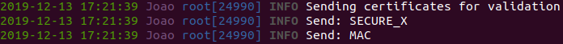
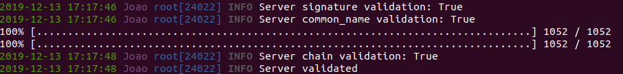
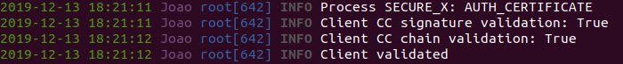
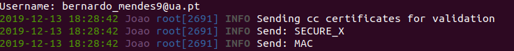

# Projeto 3: Autenticação 

**Universidade de Aveiro**  
Segurança Informática e Nas Organizações 2019/2020  

**Trabalho realizado por:**  

* 88808 - João Miguel Nunes de Medeiros e Vasconcelos 
* 88886 - Tiago Carvalho Mendes  

**Dezembro de 2019**  

## **1. Introdução**  

O presente documento tem como principal objetivo descrever detalhadamente a solução desenvolvida tendo em conta os objetivos propostos para o terceiro projeto da unidade curricular de [Segurança Informática e Nas Organizações](https://www.ua.pt/pt/uc/4143) da [Universidade de Aveiro](www.ua.pt), considerando o seu planeamento, desenho, implementação e validação tendo em conta o código fornecido como base para o trabalho. 

## **2. Planeamento**  

### **2.1 Objetivos do trabalho**

De modo a planear a solução a desenvolver, é necessário considerar **os seguintes aspetos**, presentes no guião de apresentação do projeto:  

1. **Desenhar um protocolo** para o estabelecimento de uma **sessão segura** entre o *cliente* e o *servidor* com autenticação de **ambos** os intervenientes, suportando:  

    * a) Autenticação do cliente através do cartão de cidadão  
    * b) Autenticação do cliente através de desafio resposta  
    * c) Controlo de acesso 
    * d) Autenticação do servidor utilizando certificados X.509  

2. **Implementar a autenticação do cliente**, através do cartão de cidadão.  

3. **Implementar a autenticação do cliente**, através de desafio resposta.  

4. **Implementar o suporte para controlo de acesso** 

5. **Implementar a autenticação do servidor** utilizando certificados X.509 .  

Outros aspetos a considerar são **os seguintes**:  

* **Implementação de funções genéricas** de assinatura de documentos e respetiva verificação, carregamento de certificados, geração de pares de chaves assimétricas, entre outras.

### **2.2 Fluxo de troca de mensagens**    

Para implementar os requisitos pedidos neste trabalho, definimos primeiramente qual seria o **fluxo de troca de mensagens** entre o cliente e o servidor, que de seguida iremos explicar. De modo a aumentar a segurança da nossa solução, decidimos manter alguns mecanismos utilizados na realização do **Projeto 2: Comunicações Seguras.** Este fluxo está divido em **oito fases distintas:** 

1. Início da negociação dos algoritmos a utilizar (cifras simétricas, modos de cifra e síntese)  
2. Realização do algoritmo de **Diffie Helman**  
3. Processo de autenticação do servidor, requerido pelo cliente.  
4. Processo de autenticação do cliente, iniciado por este com um pedido ao servidor, podendo ser realizado em uma de duas possíveis sub-fases:  
    **4.1.** Autenticação através de um mecanismo de desafio resposta  
    **4.2.** Autenticação através do cartão de cidadão.  

5. Pedido de transferência do ficheiro por parte do cliente, tendo em conta um mecanismo de controlo de acessos.  
6. Início da troca de informação segura através de uma **mensagem OPEN** cifrada.  
7. Envio de **pedaços** (*chunks*) de um ficheiro através de várias **mensagens DATA** cifradas.
8. Término da sessão após a transferência completa do ficheiro através de uma **mensagem CLOSE** cifrada.  

**Nota:** De realçar que todas as mensagens trocadas (exceto as enviadas antes do término da **fase 2**) são cifradas no campo **payload** de uma mensagem do tipo **SECURE_X**, acompanhadas seguidamente de **uma mensagem do tipo MAC**, com o intuito de garantir a confidencialidade e integridade das mesmas, respetivamentes.  

De seguida, apresenta-se um **diagrama de sequências UML**, ilustrando todas as mensagens trocadas entre o cliente e o servidor:


## **3. Implementação**  

### **3.1. Implementação do protocolo para autenticação do servidor através de certificados X.509**  

A autenticação do *servidor* inicia-se com a geração de um **NONCE** por parte do cliente. De seguida, o cliente envia ao servidor o NONCE através de uma mensagem do tipo `SERVER_AUTH_REQUEST`:

```python=
self.crypto.auth_nonce=os.urandom(16)
message = {'type': 'SERVER_AUTH_REQUEST', 'nonce':  base64.b64encode(self.crypto.auth_nonce).decode()}
secure_message = self.encrypt_payload(message)
self.state = STATE_SERVER_AUTH
self._send(secure_message)
self.send_mac()
```

O *servidor*, ao receber e processar esta mensagem, carrega os seu certificado, o certificado da sua raiz e a chave privada associada ao seu certificado, usando a chave privada para assinar o **NONCE** enviado pelo *cliente* . De seguida, o *servidor* envia o seu certificado,o certificado da sua raiz e a assinatura ao cliente através de uma mensagem do tipo `SERVER_AUTH_RESPONSE` :

```python=
self.crypto.server_cert=self.crypto.load_cert("server_cert/secure_server.pem")
self.crypto.server_ca_cert=self.crypto.load_cert("server_roots/Secure_Server_CA.pem")
self.crypto.rsa_private_key=self.crypto.load_key_from_file("server_cert/server_key.pem")

nonce=base64.b64decode(message['nonce'].encode())

self.crypto.signature = self.crypto.rsa_signing(nonce, self.crypto.rsa_private_key)
message={'type':'SERVER_AUTH_RESPONSE','signature':base64.b64encode(self.crypto.signature).decode(),'server_cert':base64.b64encode(self.crypto.get_certificate_bytes(self.crypto.server_cert)).decode(),'server_roots':base64.b64encode(self.crypto.get_certificate_bytes(self.crypto.server_ca_cert)).decode()}

self._send(message)
```

**Nota:** A variável `self.crypto` é um objeto da classe `Crypto`, desenvolvida por nós, com todo o processamento criptográfico da nossa solução.  

Após receber a mensagem com a assinatura e os certificados o *cliente* valida a assinatura criado pelo *servidor* com a chave pública do servidor. De seguida valida se o **common_name** do certificado do servidor é igual ao nome do servidor que ele pensa estar a conectar.

```python=
# Validate server signature
flag1=self.crypto.rsa_signature_verification(self.crypto.signature,self.crypto.auth_nonce,self.crypto.server_public_key)
logger.info(f'Server signature validation: {flag1}')

#Validate common name
flag2=self.host_name==self.crypto.get_common_name(self.crypto.server_cert)
logger.info(f'Server common_name validation: {flag2}')
```
Por fim o *cliente* cria a chain de certificados do servidor e executa todas as operações necessárias para validar cada certificado da chain:
 
1. Validar data de expiração:
```python=
today = datetime.now().timestamp()
return cert.not_valid_before.timestamp() <= today <= cert.not_valid_after.timestamp()
```
2. Validar purpose:
```python=
if index==0:
    flag=False
    for c in cert.extensions.get_extension_for_class(x509.ExtendedKeyUsage).value:
        if c.dotted_string=="1.3.6.1.5.5.7.3.1":
            flag=True
            break
    return flag
else:
    if cert.extensions.get_extension_for_class(x509.KeyUsage).value.key_cert_sign==True :
        return True
    else:
        return False
```
Ao validar o purpose dos certificados o primeiro certificado tem uma validação diferente dos outros. No primeiro certificado ,**certificado do servidor**, temos de garantir que inclui a KeyUsage **SERVER_AUTH**. Nos próximos certificados temos de garantir que incluem a KeyUsage **key_cert_sign** .

3. Validar a assinatura do certificado:
```python=
cert_to_check_signature=cert_to_check.signature
issuer_public_key=issuer_cert.public_key()

try:
    issuer_public_key.verify(cert_to_check_signature,cert_to_check.tbs_certificate_bytes,padding.PKCS1v15(),cert_to_check.signature_hash_algorithm)
except:
    print("Failed to verify signature.")
    return False

return True
```

4. Validar o common name do certificado:
```python=
if (self.get_issuer_common_name(cert_to_check)!=self.get_common_name(issuer_cert)):
    print(self.get_issuer_common_name(cert_to_check))
    print(self.get_common_name(issuer_cert))
    return False 

return True
```

5. Validar o estado de revogação do certificado :
```python=
try:
    builder = ocsp.OCSPRequestBuilder()

    builder = builder.add_certificate(cert_to_check, issuer_cert, SHA1())
    req = builder.build()
    for j in cert_to_check.extensions.get_extension_for_class(x509.AuthorityInformationAccess).value:
        if j.access_method.dotted_string == "1.3.6.1.5.5.7.48.1": 
            rev_list=None

            #Downloading list
            der=req.public_bytes(serialization.Encoding.DER)

            ocsp_link=j.access_location.value
            r=requests.post(ocsp_link, headers={'Content-Type': 'application/ocsp-request'},data=der)

            
            ocsp_resp = ocsp.load_der_ocsp_response(r.content)
            if ocsp_resp.certificate_status== ocsp.OCSPCertStatus.GOOD:
                return False
            else:
                return True

            
                        
except Exception as e:
print(e)
print("OCSP not available")

try:
    for i in cert_to_check.extensions.get_extension_for_class(x509.CRLDistributionPoints).value:
        for b in i.full_name:
            rev_list=None
            #Downloading list
            file_name=wget.download(b.value)
            #read revocation list
            try:
                rev_list=self.load_cert_revocation_list(file_name,"pem")
            except Exception as e :
                print(e)
            try:
                rev_list=self.load_cert_revocation_list(file_name,"der")
            except:
                print("Not der.")
            if rev_list is None:
                return False
            
            flag=cert_to_check.serial_number in [l.serial_number for l in rev_list]
except Exception as e:
    print("CRL not available")
```
Ao validar o estado de revogação dos certificados tentamos inicialmente realizar esta tarefa através de OCSP e se nao for possivel recorremos a CRL e às DeltaCRL. É importante referir que parte do código foi omitido do relatório por ser muito extenso.

Se todas estas condições forem validadas o *cliente* irá validar o servidor e transitar para a próxima de fase onde se irá autenticar.

Os certifcados usados para represntar o servidor foram criados através do programa **XCA** e exportados no formato PEM para poderem ser carregados pelo servidor e enviados para o cliente. Adicionalmente criamos uma lista de certificados e colocamos-a num url online para poder ser incluida nos certificados como *CRLDistributuion Point*, permitindo assim a validação do estado de revogação dos certificados do servidor pelo cliente.

#### Servidor  

#### Cliente  



### **3.2. Implementação do protocolo para autenticação de utentes através da apresentação de senhas**  

### **3.3. Implementção do mecanismo para controlo de acesso**  

### **3.4. Implementação do protocolo para autentição de utentes através do cartão de cidadão**  

Em alternativa à autenticação do *cliente* através da apresentação de senhas, implementamos a autenticação através do cartão de cidadão. Tal como no protocolo de senhas começamos por enviar uma mensagem ao servidor, depois deste ser validado, com um **Nonce** através de uma mensagem do tipo `CARD_LOGIN_REQUEST` : 

```python=
message = {'type': 'CARD_LOGIN_REQUEST', 'nonce':base64.b64encode(self.crypto.auth_nonce).decode()}
secure_message = self.encrypt_payload(message)
self._send(secure_message)
self.send_mac()
```

O *servidor*, ao receber e processar esta mensagem, guarda o **NONCE** enviado pelo cliente e gera outro **NONCE** que irá enviar para o cliente através de uma mensagem do tipo `CARD_LOGIN_RESPONSE`:

```python=
self.client_nonce = base64.b64decode(message['nonce'].encode())
self.crypto.auth_nonce = os.urandom(16)
message = {'type': 'CARD_LOGIN_RESPONSE', 'nonce': base64.b64encode(self.crypto.auth_nonce).decode()}
secure_message = self.encrypt_payload(message)
self._send(secure_message)
self.send_mac()
```

Após receber a mensagem com o **NONCE** do servidor, o *cliente* irá inserir o seu nome de utilizador para garantir a validação do controlo de acesso (explicado no anteriormente no ponto 3.3) e irá assinar com o seu cartão de cidadão a concatenação do **NONCE** gerado por ele com o **NONCE** enviado pelo servidor. De seguida, vai enviar o certificado de autenticação do cartão de cidadão utilizado para gerar a assinatura, a assinatura e o username através de uma mensagem do tipo `AUTH_CERTIFICATE`:

```python=
self.credentials['username'] = input("Username: ")

self.server_nonce = base64.b64decode(message['nonce'].encode())
cert, signature = self.crypto.card_signing(self.crypto.auth_nonce+self.server_nonce)
   
secure_message = self.encrypt_payload({'type': 'AUTH_CERTIFICATE','cert':base64.b64encode(cert).decode(), 'signature': base64.b64encode(signature).decode(),'credentials':{'username':self.credentials['username']}})
self._send(secure_message)
self.send_mac()
```
O *servidor* ao receber esta mensagem, começa por verificar se o username existe na sua lista de users (necessário para efetuar a seguir a validação do controlo de acesso) e de seguida valida a assinatura enviada pelo cliente, com a chave pública presente no certificado do mesmo.

Por fim, tal como na validação da cadeia de certificação do servidor, o servidor irá construir a chain de certificados associada ao cartão de cidadão do cliente, validando cada certificado em relação à data de expiração, purpose,assinatura do certificado,common name e estado de revogação.

É importante referir, que ao validar o estado de revogação do certificado da raiz do estado através de OCSP, recebemos o estado *REVOKED*.Após alguma pesquisa e questionar os docentes, acabamos por não conseguir encontrar solução e por isso considera-mos que neste caso o certificado está validado, tal como foi sugerido pelo docente Vitor Cunha.

Se todas estas condições forem validadas o *servidor* irá validar o cliente e transitar para a próxima de fase , onde o cliente poderá iniciar o envio do ficheiro.

#### Servidor  

#### Cliente  



## **4. Conclusão**  

Após a realização deste segundo trabalho prático, concluímos que os objetivos propostos no guião disponibilizado foram, de uma forma geral, alcançados com sucesso. Com este trabalho, os nossos conhecimentos sobre comunicações autenticadas e mecanismos de autenticação utilizados para as implementar aumentaram. É de salientar ainda que o trabalho de equipa e a superação de dificuldades foram fatores importantíssimos no sucesso do trabalho, melhorando as competências interpessoais de ambos os elementos do grupo.

## **5. Bibliografia**    

A bibliografia utilizada foi a seguinte:  

* [cryptography.io](https://cryptography.io)
* [https://joao.barraca.pt/](https://joao.barraca.pt/)