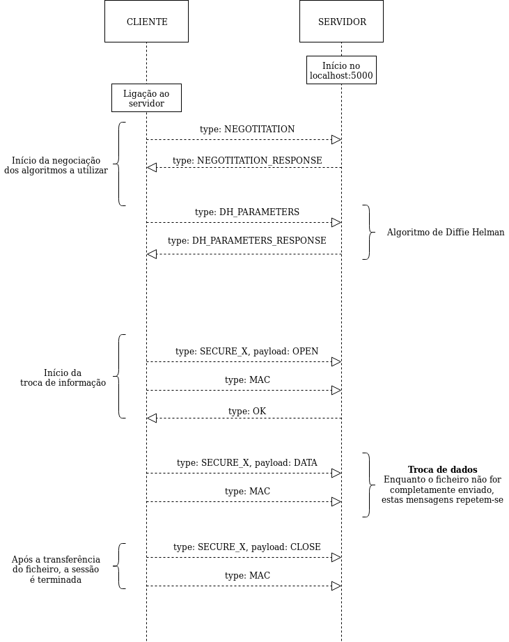

# Projeto 2: Comunicações Seguras  

**Universidade de Aveiro**  
Segurança Informática e Nas Organizações 2019/2020  

**Trabalho realizado por:**  

* 88808 - João Miguel Nunes de Medeiros e Vasconcelos 
* 88886 - Tiago Carvalho Mendes  

**Novembro de 2019**  

## 1. Introdução  

O presente documento tem como principal objetivo descrever detalhadamente a solução desenvolvida tendo em conta os objetivos propostos para o segundo projeto da unidade curricular de [Segurança Informática e Nas Organizações](https://www.ua.pt/pt/uc/4143) da [Universidade de Aveiro](www.ua.pt), considerando o seu planeamento, desenho, implementação e validação tendo em conta o código fornecido como base para o trabalho.  

No guião de apresentação deste segundo projeto, era pedido o *planeamento*, *desenho*, *implementação* e *validação* de um protocolo que permita a **comunicação segura** (confidencial e íntegra) entre dois pontos, nomeadamente **um cliente e um servidor** através de uma ligação por **sockets TCP**, em [Python](https://realpython.com/python-sockets/).

## **2. Planeamento**  

### 2.1 Objetivos do trabalho  

De modo a planear a solução a desenvolver, é necessário considerar **os seguintes aspetos**, presentes no guião de apresentação do projeto:  

1. **Desenhar um protocolo** para o estabelecimento de uma **sessão segura** entre o *cliente* e o *servidor*, suportando:  

    * a) Negociação dos algoritmos usados  
    * b) Confidencialidade  
    * c) Controlo de integridade  
    * d) Rotação de chaves  
    * e) Suporte de pelo menos duas cifras simétricas (ex: AES e Salsa20)  
    * f) Dois modos de cifra (ex: CBC e GCM)  
    * g) Dois algoritmos de síntese (ex: SHA-256 e SHA-512)  

2. **Implementar a negociação** de algoritmos de cifra entre cliente e servidor.  

3. **Implementar o suporte para confidencialidade**, resultando em mensagens cifradas.  

4. **Implementar o suporte para integridade**, resultando na adição de códigos de integridade às mensagens.  

5. **Implementar um mecanismo para rotação da chave** utilizada após um volume de dados ou tempo decorrido.  

Outros aspetos a considerar são **os seguintes**:  

* **Implementação de funções genéricas** de cifra/decifra/cálculo de um MAC/verificação de um MAC de textos  

* **Criação de novos tipos de mensagens** a enviar, incluindo as mensagens já existentes dentro do conteúdo destas novas mensagens (num formato cifrado e íntegro).  

### 2.2 Fluxo de troca de mensagens  

Para cumprir os objetivos pretendidos com a realização deste projeto, primeiro definimos qual seria o **fluxo de troca de mensagens**, que de seguida iremos explicar. Este fluxo está dividido em 5 fases distintas:  

1. Início da negociação dos algoritmos a utilizar  
2. Incorporação do algoritmo de **Diffie Hellman**  
3. Início da troca de informação segura através de uma **mensagem *OPEN*** cifrada.  
4. Envio de pedaços (*chunks*) de um ficheiro através de várias **mensagens *DATA*** cifradas.  
5. Término da sessão após a transferência completa do ficheiro através de uma **mensagem *CLOSE*** cifrada.  

**Nota:** De realçar que as mensagens cifradas são seguidamente acompanhadas de uma **mensagem do tipo MAC**, com o intuito de controlar a integridade das mesmas.

De seguida, apresenta-se um **diagrama de sequências UML**, ilustrando todas as mensagens trocadas entre o *cliente* e o *servidor*:

